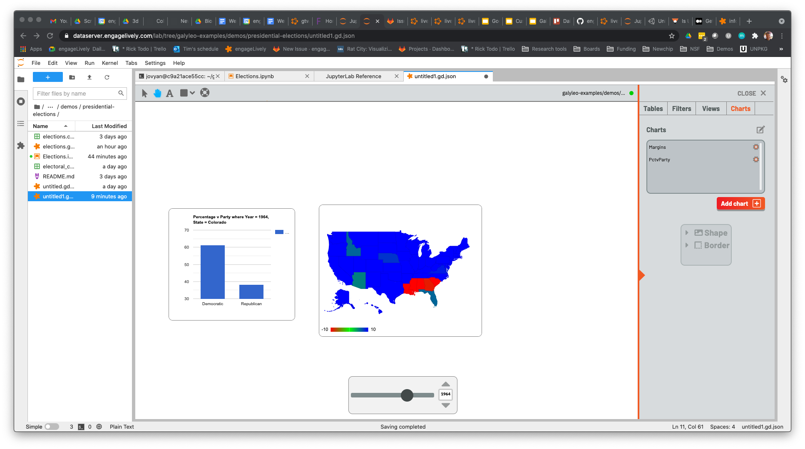
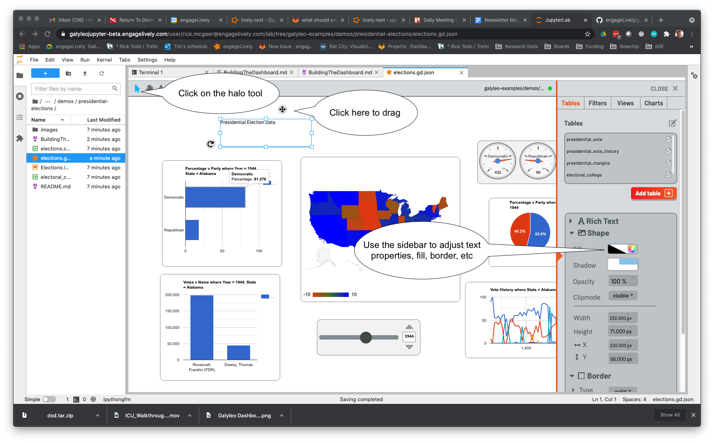

# Building the Dashboard
Typically, a dashboard is built alongside the Notebook which is supplying it data. In fact, the call `client.send_data_to_dashboard(table)` sends a table to an _open_ dashboard tab.  So start by clicking File>New>Galyleo Dashboard to get an open dashboard.

We can't do much with the dashboard until it has some data, so just merrily execute cells until you've executed the first `client.send_data_to_dashboard(table)`.  At this point, click over to the untitled.gd.json tab and see that there's a table in the Table box (make sure Tables is selected in the tab chooser at the top right).

We will need some more data on the dashboard before we turn this into a table.  However, this table does have a "Year" column, and we are going to want to create a filter for that.
_About filters_: A _filter_ is a user interface element that selects a value (or range of values) from a column.  This can be used to choose subsets of rows from a particular table, to create what we call a _view_.  A _Select_ filter chooses a specific value; a _Range_ filter chooses a range of values.  This is the way that the dashboard viewer chooses what data to display on a dashboard.  In this case, we're going to get a Slider (an example of a Select filter) to choose the year.  So click over to the "Filters" tab, click on add filter, type "YearFilter" into the name input of the popup, choose "slider" from the Filter Type pulldown menu and "Year" from the column pulldown menu, then click "Create Filter".

A filter appears in the top-left corner.  Make sure the hand icon is selected in the top bar, then drag the slider anywhere convenient.  Play with the slider a bit; note that it increments by four, the low end is 1828, and the high end is 2020.

Execute the rest of the notebook.  When that is done, we now have all the data in the dashboard, so it's time to build some charts.  But the first thing to do is construct a _View_

A _View_ is a subset of a table; a selection (and, potentially, a reordering) of the columns of a table, and a subset of its rows, chosen by one or more Filters.  While a chart can take as input a _Table_, such a chart wouldn't respond to user inputs (because a user selects the rows he's interested in by adjusting a Filter, and filters only affect the rows in Views).  

To construct a view, click over to the Views Tab, then click "Add view".  A popup appears.  Choose a name, say "Margins" (it cannot conflict with a Table name), and then pick "presidential_margins" from the table pulldown.  Click "Create View".

An editor popup appears, inviting you to choose the columns of the view and the filters which will pick the rows.  We want our columns to be "State" and "Margin", _in that order_.  Fortunately, they are in the right order now; were they not, we'd use the pen icon (top right) to toggle between select and order mode, and then drag columns into the right order.  Select columns "State" and "Margin". We want to only look at data for the year selected by YearFilter, so select this in the filters box and click "Update view".  The view is now in the view box.  We can just click the gear icon next to it to edit this view again.

_We get to build a chart_!  Now that everything is in place, click over to the Charts tab, click "Add chart".  A popup appears; choose "Margin" as the chart name (as we'll see later, this cannot conflict with the name of a _Filter_!).  Choose "Margins" from the pulldown, and click "Create chart".

A table appears in the top left; _that's not our chart!_ Well, OK, it is, but  it won't be for long.  Also appearing is the Google Chart Editor.  Click on charts.

On the left-hand panel, click Maps, then choose a GeoChart (top choice) and click customize.

Set the max color to blue (Democratic),the mid to Green (other), and the min to red (Republican), choose region "United States" from the pulldown, and click OK

Slide the slider and watch the colors change.  If you want to adjust the chart, click the gear icon next to its name on the chart list and the editor will come up.  
The next few steps are just a repeat of the steps we've done so far.  Create a view, and then create a chart for that view and customize it.  We'll do one more in detail to point out an interesting feature.
The next view/chart to create is the percentage of the vote vs party for a given state and year.  We know how to select the year; but where is the select filter for a state?  The answer is, _the Margins chart_.  In Galyleo, _every_ chart is a select filter; clicking on the chart picks an x-, or category-axis value.  In a GeoChart, it's the name of the region you click on; in a pie chart, the category corresponding to the wedge; in a bar or column chart, the category corresponding to the bar/column, etc.  And this shows up easily and naturally.
Click on views, Add view, and bring up the view popup.  Choose presidential_vote as the table, and "PctvParty" as the name.

The popup _now has Margin as a Filter choice!_  This is why Charts and Filters share the same namespace.  _Every Chart is a Filter!_  In this case, we're going to use Margin to select the State.  Click "Party" and "Percentage" as the columns (and make sure Party is above Percentage), and choose "Year Filter" and "Margins" as the filters, then Update view

Let's make a chart using this view:

In the chart editor, I selected a Column Chart, and clicked OK.  The dashboard should now look something like this:

Click on the map and watch the numbers change; move the slider and watch the numbers change.
Creating the rest of the views and charts is just a repeat of the steps we've done so far.  Here's a list of the views I created, with the columns in order and the filters selected

### Filters
| View | Table | Columns | Filters |
|------|------|------|------|
| VoteByCandidate | presidential_vote | Name, Votes | YearFilter, Margins |
| PctHistory | presidential_vote_history | Year, <all parties> | Margins |
| ec | electoral_college | Democratic, Republican, Other | YearFilter |

### Charts

And these were used in the following charts:
| Chart | View | Chart Type  | Options |
|-------|-------|-------|-------|
| VoteByCandidate | VoteByCandidate | Bar Chart | |
| Vote History | PctHistory | Line Chart | Use first column as labels (checkbox) |
| electoral_college | ec | Gauge Chart | set max to 538, min  to 0 |

At this point, the dashboard should look like this:

    
Let's add some decorations.  First, add a headline.  Click on the 'A' in the top bar (text).

It will turn blue

    
Drag the mouse anywhere in the screen and see an empty box:

Type "Presidential Election Data" in the box, then select the Halo mode and select the box again.  A halo of tools will appear around the textbox, and the right sidebar will pop out.  Use the stylers in the right sidebar to select font and styling of the text, and set the border width to be zero.  use the drag tool (cross, top-right of the halo) to move the bar into position.

Do this again to add the 1828-2020 subtitle.  The dashboard now looks like this:
    

Now let's add some images.  Click on the top bar shapes menu and select image:

This is a stock image, and we'd like to change it.  This is done by URL.  CLick on the right sidebar and, in the imageURL box, enter the image URL you'd like displayed.  (Of course, ensure that you have the right to use the image first).

![Image URL] (images/set-image-url.png)
    
