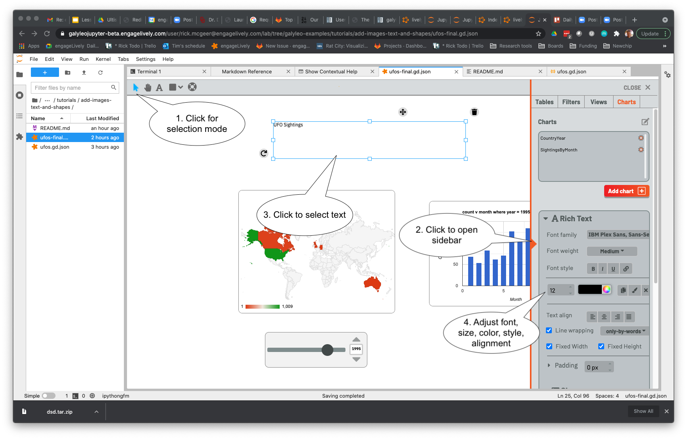

# Tutorial 7: Adding Images, Text, and Shapes to Your Dashboard

Dashboards need (and look better with) explanatory images, text, and shapes.  In this tutorial, we'll show you how to add
images, texts, and shapes to a dashboard, and how to configure them -- changing size, shape, border, color; for images, the image
from an URL, and for text, the string and font properties.

It should be noted that there are a wide range of properties for images, texts, and shapes -- particularly text.  In the interest of brevity, this tutorial won't be inclusive.  A comprehensive guide is given in the [User Guide](https://galyleo-user-docs.readthedocs.io/en/latest/userguide.html).

# What You'll Learn

1. Creating shapes, and the kinds of shapes in Galyleo
2. Creating images
3. Creating text
4. Positioning images, shapes, text, filters, and charts
5. Editing the physical properties of anything on a dashboard -- Borders, colors, and fill
6. Changing the properties of text

# Prerequisites

1. None (The Dashboard has been progressively prepared through previous tutorials in this series, so going through them is helpful).

# Uses

1. Galyleo Dashboards

# Instructions

The dashboard developed previously is in this directory, in the file ufos.gd.json.  Open it up: it will look like this:

Start by adding some text.  Click on the A on the toolbar; it will turn blue.

Now click on the dashboard and drag the mouse to form a box (you can resize it later).  Click inside the box and type "UFO Sightings".

This text needs to be styled.  Click "Selection Mode" (arrow, top left), then open the right sidebar.  Then click on the textbox to indicate what's to be styled, and use the tools in the right sidebar to choose font, font size, style, color, and so on.

Scroll down in the sidebar; at the bottom are tools to control the border of the text box.  Set the width to 0 pixels and the box will only appear when selected.

Time to add a shape.  Click on the shapes menu (next to text, top left).  The shapes are Rectangle, Ellipse, Image, and Label.  Choose Ellipse.  The shape will change into an oval and it will show in blue

Drag an oval over the text, and then use the right sidebar to style it.  The oval now hides the text, which isn't what's wanted.  Right-click on the oval to bring up the Context menu (the browser menu may show up first; click elsewhere to get rid of it).  The context menu has two items: Bring to front and Send to back.  Click Send to back.

The text now appears on top of the oval.  After choosing a softer color, this is how it appears:

Finally, add an image.  Select image from the shapes menu, then drag the mouse to get a stock image to appear in the design.  All images in Galyleo are selected by URL, so type in the URL of the image you want in the sidebar (one common technique is to find the right image using Google, copy the image address, and then paste the image into the sidebar).

**Important: only use images that you are permitted to use in this context!** Check for public-domain or other appropriate permissions (e.g., Creative Commons license), or use images that will be approved by the copyright holder.   The image used here was for [Canada's Commemorative Coin](https://www.mint.ca/store/coins/1-oz.-pure-silver-glow-in-the-dark-coin---canadas-unexplained-phenomena-the-falcon-lake-incident---mintage-4000-2018-prod3160015) for the [Falcon Lake Incident](https://www.cbc.ca/archives/entry/canadas-most-famous-ufo-encounter).  The image URL is .

The final dashboard is in the file ufos-final.gd.json and  looks like this:

