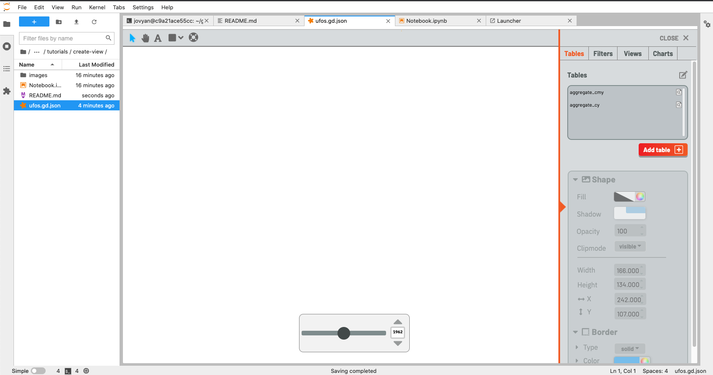
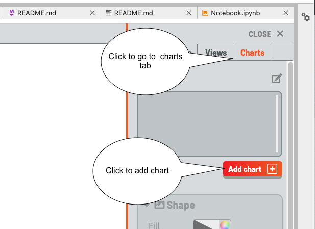
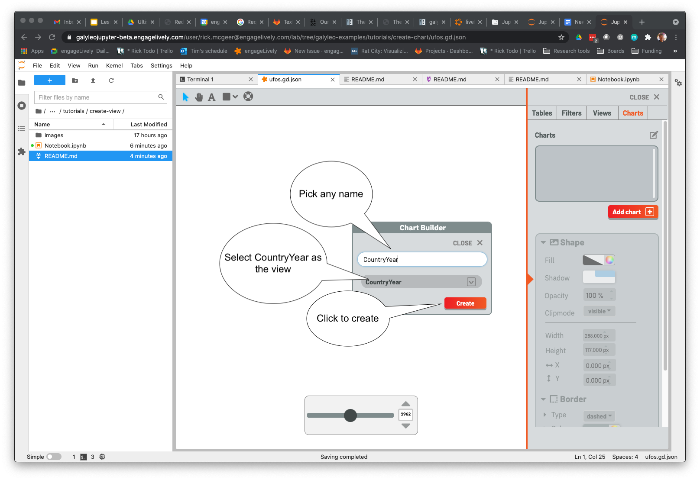
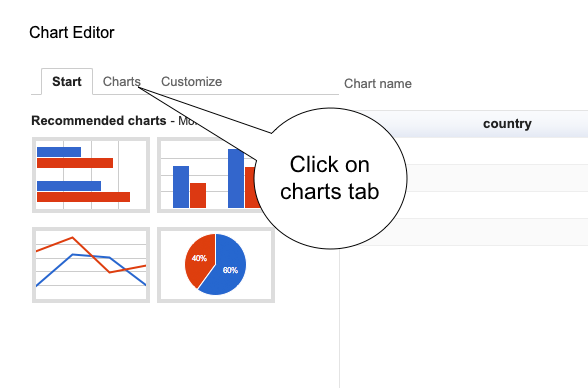
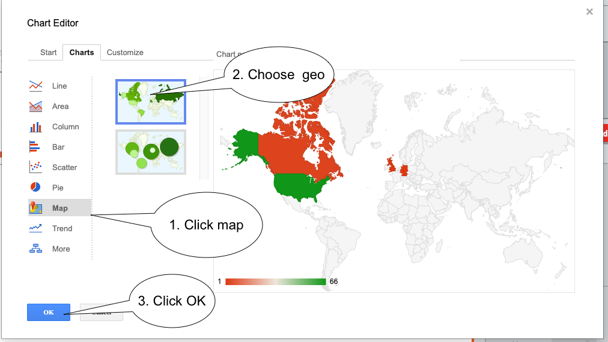
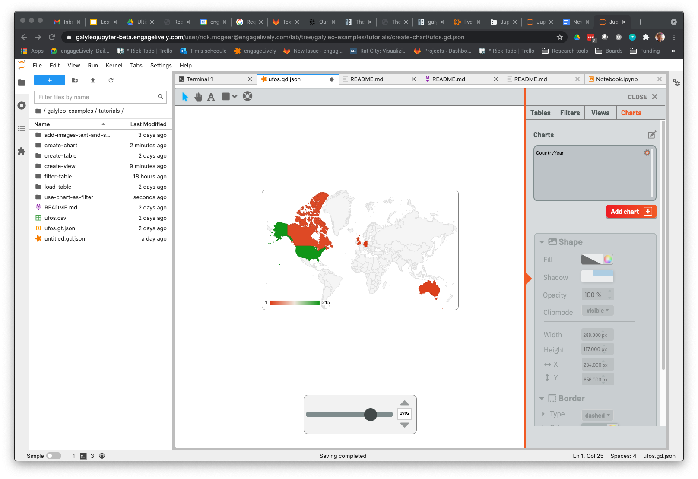

# Tutorial 5: Creating Charts

At last!  With the prepatory work done, we can now create a responsive chart.  Creating a chart is actually very simple -- most
of the work was done in creating Views.

# What You'll Learn

1. Creating a Chart
2. Choosing the View/Table as the Chart's Data Source
3. Changing the Chart Type and customizing charts
4. Editing charts after creation

# Prerequisites

1. Create Table
2. Load Table
3. Create Filters
4. Create Views

# Uses
1. Galyleo Dashboards

# Instructions

As with the create-view tutorial, ufos.gd.json is the Dashboard we've prepared with tables loaded and filters and views created.  Open it, and this is what you should see:

Click on the chart tab and click on add chart

This brings up the Chart creation dialog.  Choose any name, and CountryYear as the view, then click "Create".

A table with the values appears in the top left; a table is the default chart, simply because any dataset can be rendered in a table.  That isn't usually the one wanted, so a Chart Editor pops up at the same time.  Click on the "Charts" tab on the Chart Editor.

Choose "Maps"  as the category, then choose the top (GeoChart) map.  The default options for this work, but if you want you can always click the customize tab to choose colors, etc.

Click OK, the editor disappears, and you now have a GeoChart that's responsive to the slider.  Play with it for a bit.  If you'd like to edit the chart, click the gear icon next to the chart name to bring up the Chart Editor

