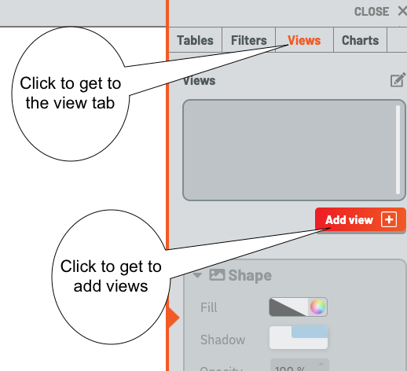
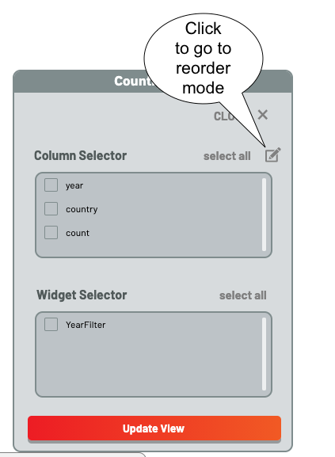
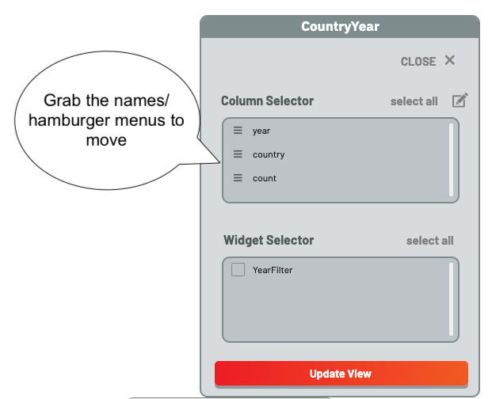
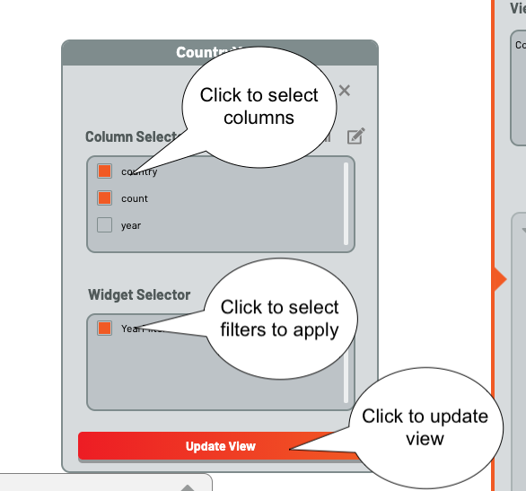

# Creating Views

A View is a subset of a table.  These form the key building blocks for dashboards -- namely, making charts responsive to user actions
on filters.  While charts can and do use a raw table as a data source, _almost all_ charts -- and _all_ charts that respond to user
input -- use a view as a data source.  
In a View, columns are manually chosen -- and, importantly, ordered by the dashboard creator -- and rows are selected by filters.

# What You'll Learn

1. Creating a View
2. Ordering and Selecting the Columns in a View
3. Filtering rows with widgets

# Prerequisites

1. Create Table
2. Load Table
3. Create Filters

# Uses

1. Galyleo Dashboards
2. Notebooks

# Instructions
As always, fire up a Dashboard from the launcher, and execute Notebook.ipynb to fill the Dashboard with tables

When we're done, use the Filter Creation technique, taught in the previous tutorial, to create a Slider filter on the "Year" column, and move the widget somewhere convenient.  Now click on Views; the dashboard should look like this:

Click on Add View to add a view, and get the View Creation popup:

Choose "aggregate_cy" as the table, pick any name other than an existing table as the name, and then click "Create". The View will appear in the Views list, and the View Editor popup will appear

The order of columns in a view is very important; the first column defines the Category, or X, axis in most charts.  Click on the pen icon in the top left to go into reorder mode.

The icons beside the columns turn into hamburgers and the mouse turns into a grab.  Use the mouse to reorder columns with country on top and count next, then click the reorder icon again to go back into select mode

Select the "country" and "count" columns, and select the "YearFilter" slider widget, then "Update View".  The View now has two columns -- country and count -- and will show the data for the year selected by the YearFilter widget.

