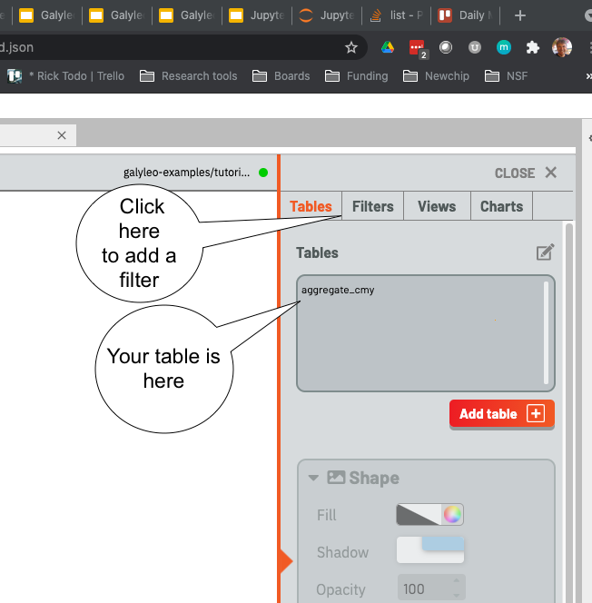
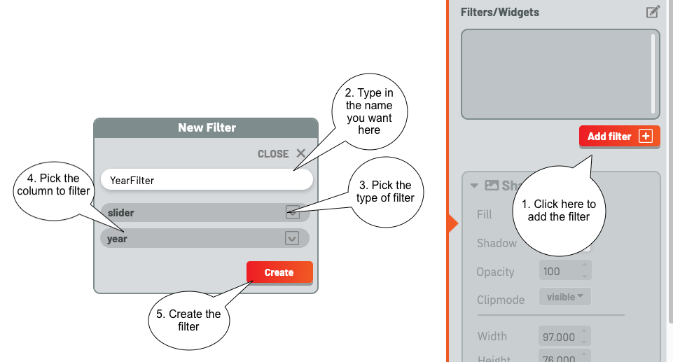
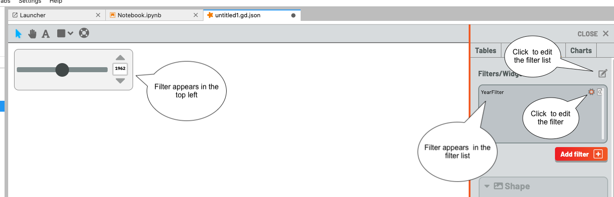
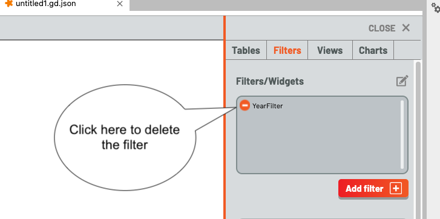

# Techniques for Filtering Data

This tutorial demonstrates  building a filter to filter rows from one or more tables in response to user inputs
# What You'll Learn

1. Creating a Filter
2. The difference between range and select filters, and what each type is used for.
3. The different filter widgets (to date) in Galyleo
# Prerequisites

1. Create Table
2. Load Table
# Uses

1. Notebooks
2. Galyleo Dashboards

# Instructions
Launch a new dashboard, and then open Notebook.py.  Once the dashboard has been opened, execute all the cells in Notebook.ipynb.  Click over to the dashboard, click the chevron to open the sidebar (middle, right-hand side) and you should see this:

Click on "Filters" to bring up the filters tab, then click on "Add Filter".  The Filter builder/editor will pop up, inviting you to build a filter.  Type in the name, select the kind of widget to use (more below) and the column to filter.  Then click on Create.

When you click Create, the widget appears in the top-left and the filter name appears in the filter list.  A gear button next to the filter lets you edit it.

Finally, clicking on the selection/edit button on the top right will let you edit the set of filters, so you can click on that and delete filters by clicking on the delete button to the left of the filter name

