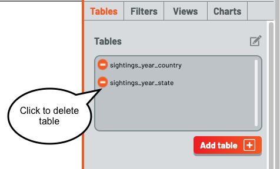

# Techniques for Loading a Table using the Galyleo Client Library

This tutorial demonstrates  using the Galyleo Dashboard Client to send a table created with the Galyleo Table library to a Galyleo Dashboard.

# What You'll Learn

1. Connecting the client to the dashboard
2. Sending a table to every open  dashboard
3. Previewing a table
4. Sending a table to a chosen dashboard
5. Deleting a table.

# Prerequisites

1. Create Table

# Uses

1. Jupyter Notebooks
2. Galyleo Dashboards

# Instructions
**Notebooks can only send data to open Dashboards!** So start the tutorial by opening a dashboard using the File Menu or the launcher to open a dashboard

You'll see the Dashboard open in a JupyterLab tab.  Here is an annotated image.  A Dashboard is just another file, and the Dashboard Studio is simply an editor for that file.  The annotated image shows the toolbar, including the bug reporting button, and the sidebar, which is used to add and edit dashboard elements.

To demonstrate selective send, we're going to have a second dashboard, named test1.gd.json.  Open up a second dashboard, and rename it (using the File Menu or renaming in the file browser) to "test1.gd.json".  Now, click over to untitled.gd.json, and click on the sidebar opener to open the sidebar.  This is what you'll see:

The top third of the Sidebar keeps track of, and lets you manipulate, the major data items of a Galyleo Dashboard: Tables of data, Filters which select rows from Tables, Views, which are subsets of Tables (selected columns and filtered rows), and Charts, which display data from a single View or Table.  The orange highlight indicates you're looking at Tables.  Now open the Notebook and start executing it

Execute the first five cells, up through the line ``client.send_data_to_dashboard(table)``.  Now click over to untitled.gd.json and see this:

Clicking on the magnifying glass brings up a preview of the table **Warning!  This can be slow for large tables!**

Close the preview window and return to the Notebook.  Execute the remaining two cells, up through the line ``client.send_data_to_dashboard(table2, 'test1.gd.json')``.  Now look at the tables in test1.gd.json and untitled.gd.json.  This is what you'll see:

Naming a dashboard sends tables *only to that dashboard*.  

Finally, delete the exta table in test1.gd.json.  Click on the pen icon over the top-right corner of the Table List to go into Edit mode.

The inspection icon disappears and is replaced with a Delete button to the left of the table name.  Click on a delete button to delete the corresponding table

Click the Edit Mode button again to go back to Inspection Mode.  Edit Mode/Inspection mode are repeated for each of Tables, Filters, Views, and Charts.