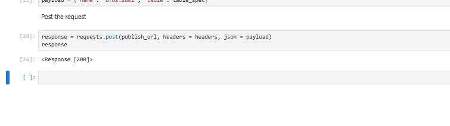
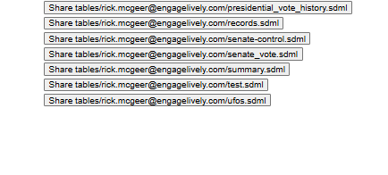

# Publish Table
This tutorial shows how to publish an SDML table to the Galyleo Service.

## The Tutorial
The Notebook reads the SDML file we created in the create-table tutorial, turns it  into an SDML table and publishes it to the Galyleo service.
As per our stanrd practice, _no specialized client software is required_.  IN fact, the `sdtp` library is not required; we use it as a convenience.

## Description
This Notebook first reads the `ufos.sdml` file and then uses the Galyleo Services REST interface to publish the table under the name tables/<user>/ufos.sdml

## To Start
Select "Galyleo Service" from the Galyleo Menu

The Galyleo Services Tab will appear

Click on the "View Tables" button on the top bar.  You'll the current tables for this userid

Click back to Home.  We're going to use the `/services/galyleo/publish_data` API method
## Open the Notebook
Open Notebook.ipynb and run the cells.  Check the response code for the final call.  It should be 200:

If it is, the upload succeeded.  Click on View Tables in the Galyleo Services community.  You'll see your table there

## Bonus: Make it Publicly Readable
By default, dashboards and tables are only viewable by their authors.  However,. you can make any dashboard or table readable by everyone.  Click on the button `Share <table name>`

A submenu is brought up, with checkmarks next to the people the item is shared with `PUBLIC` shares an item with everyone.

