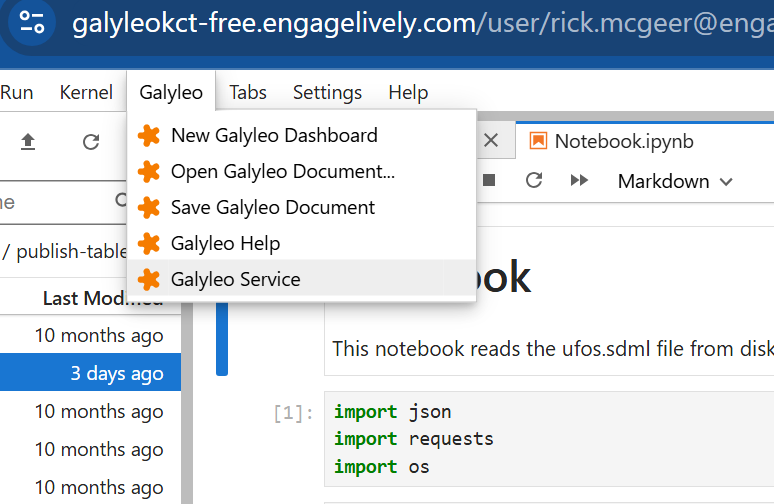
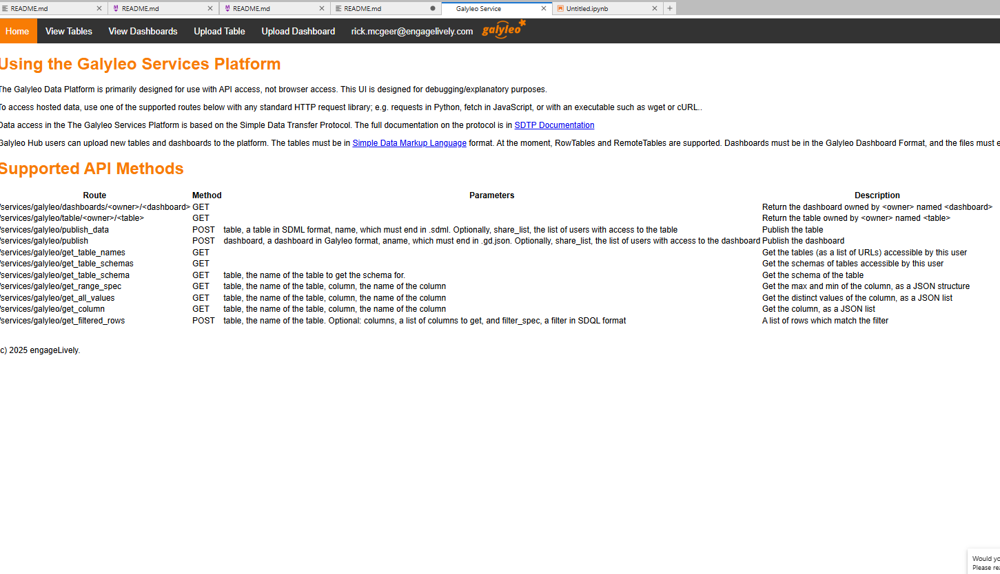
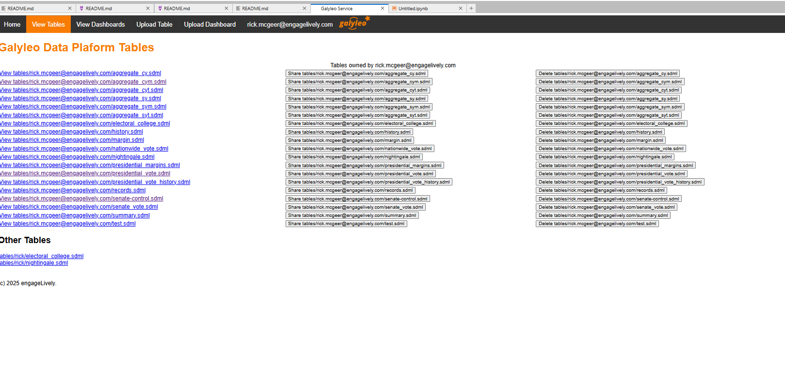
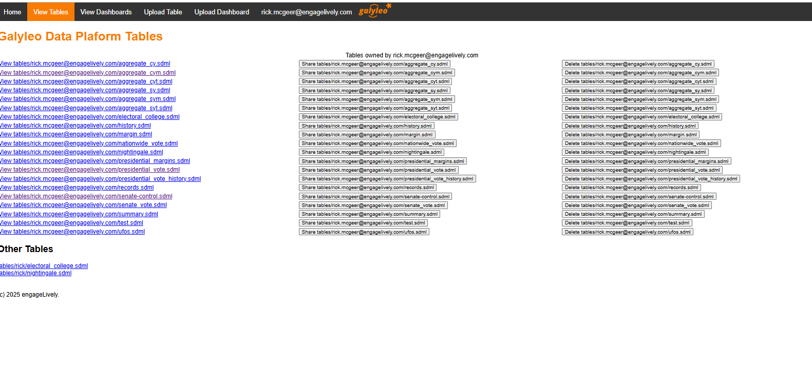
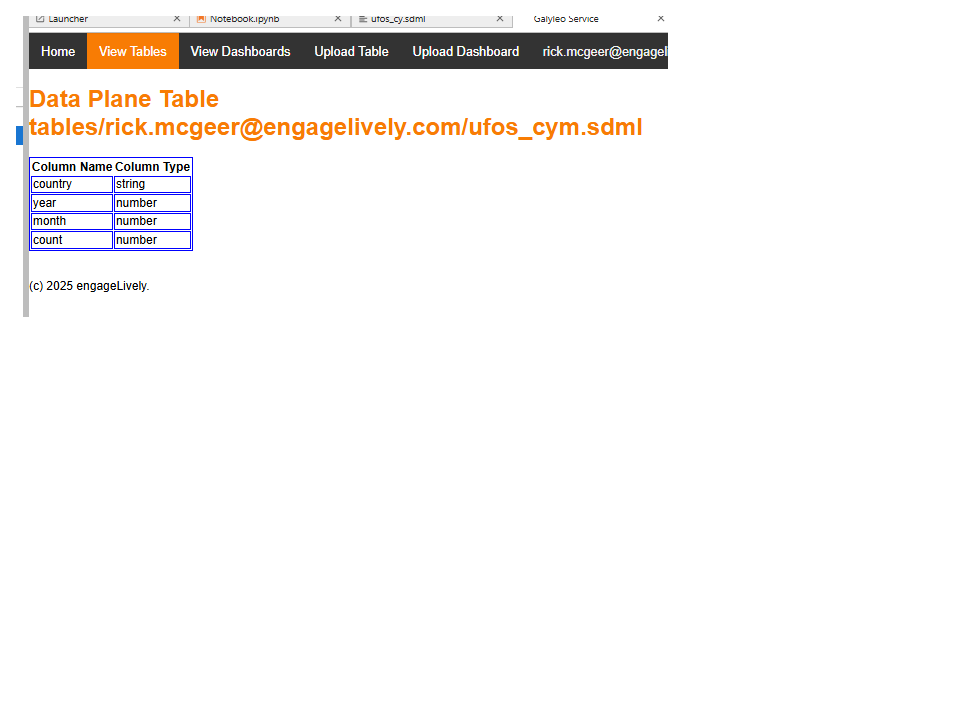
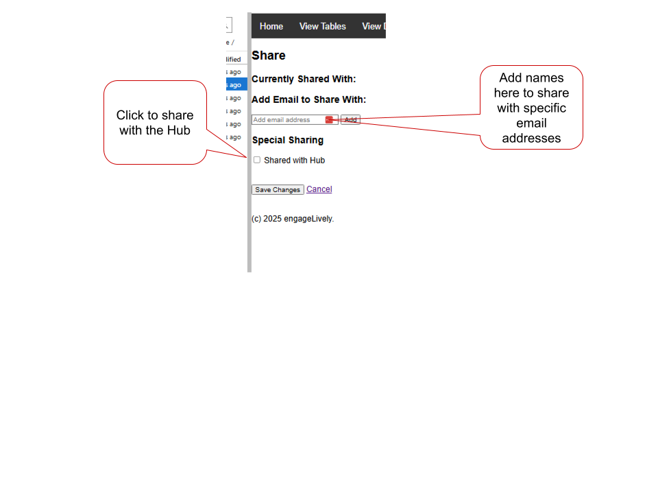

# Tutorial 2: Publish Table
This tutorial shows how to publish an SDML table to the Galyleo Service.

## The Tutorial
The Notebook reads the SDML file we created in the create-table tutorial, turns it  into an SDML table and publishes it to the Galyleo service.
As per our standard practice, _no specialized client software is required_.  In fact, the `sdtp` library is not required; we use it as a convenience.

## Description
This Notebook first reads the `ufos.sdml` file and then uses the Galyleo Service REST interface to publish the table under the name tables/<user>/ufos.sdml.

## To Start
Select "Galyleo Service" from the Galyleo Menu.

The Galyleo Services Tab will appear.

Click on the "View Tables" button on the top bar.  You'll  see the current tables for this userid.

Click back to Home.  We're going to use the `/services/galyleo/publish_data` API method.

## Open the Notebook

Open Notebook.ipynb and run the cells.  Now check if the tables were published.  Click on the 
"Galyleo Service" item on the "Galyleo" menu.

This will bring up the Galyleo Service page in a new tab.  Go to that tab, and then click on View Tables in the Navigation Bar.  You'll see your table there:

Clicking on the table link will bring up its schema:

## Bonus: Make it Publicly Readable

By default, dashboards and tables are only viewable by their authors.  However, you can make any dashboard or table readable by everyone.  Click on the button `Share <table name>`.

A submenu is brought up, with a list of users with whom the table is currently shared.  Click the remove button to remove an existing user, enter new users (email addresses) in the text box and click "Add", or check the box to share with all Hub users.  Click "Save Changes" when done.

