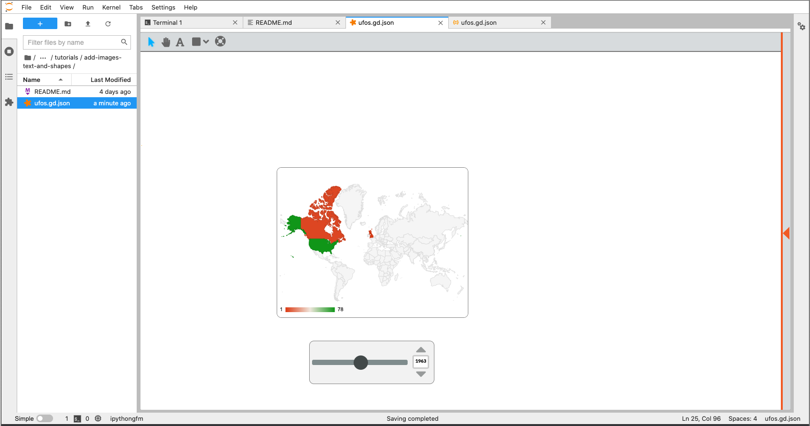
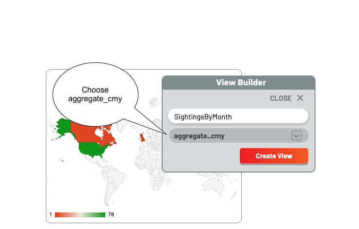
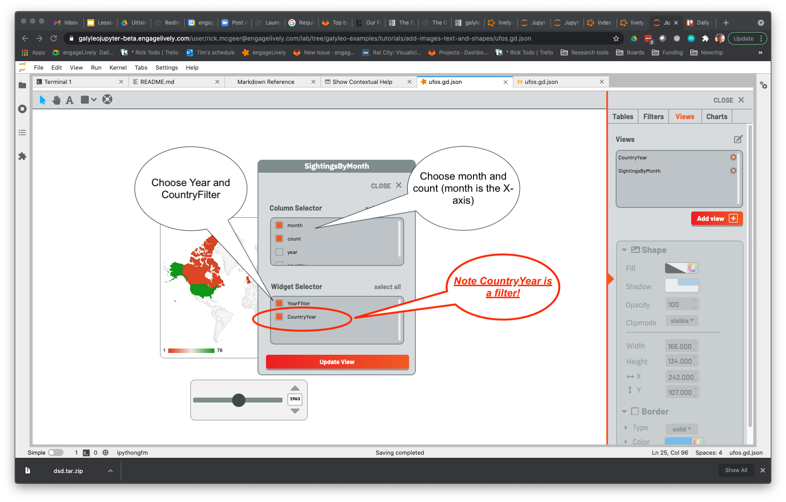
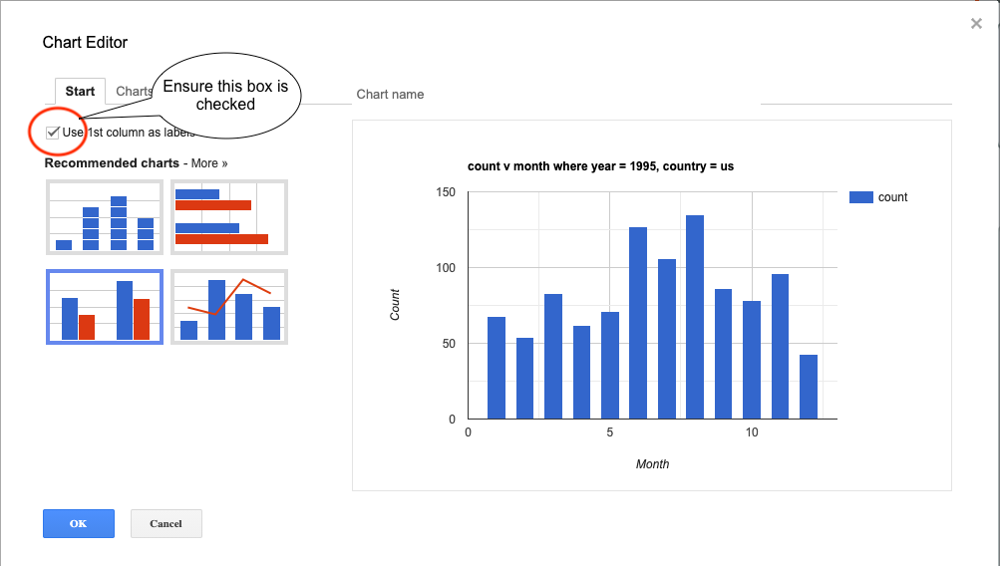
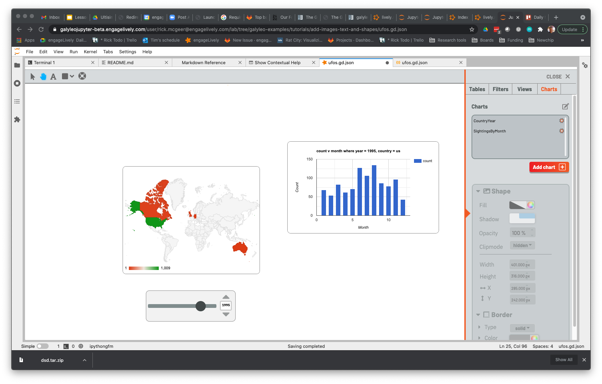

# Using Charts as Filters

Every chart is inherently a filter; specifically, a select filter on the category, or x-axis of the chart.  In a map, for example,
this is used to select the region of the map that the user has clicked on; in a pie chart, the wedge.  This is used to drill down
on a data set and drive a detailed chart.

# What You'll Learn

1.  How a chart appears as a widget in the view area
2.  What clicking on various charts does

# Prerequisites

1. Create Table
2. Load Table
3. Create Filters
4. Create Views
5. Create Charts

# Uses

1. Galyleo Dashboards

# Instructions
As in the last three tutorials, we're going to use the dashboard from the previous tutorial as a starting point.  It's in ufos.gd.json, and if you click on it you'll see this:

Click over to Views, Add View, and in the View Creator choose aggregate_cmy as the underlying table

The View Editor pops up.  **Notice that *CountyYear* is a filter as well as a chart!** This is because clicking on a country on the chart selects that country from the country column.  This permits us to create drill-down charts.  Select month and count as columns (make sure month is ahead of count in the column list)and select both YearFilter and CountryYear from the filter list.

**Note**: this is why Charts and Filters form a single namespace -- a chart and a filter can't share the same name.  They share the role of filters.  Similarly, since either a View or a Table can be the source of data for a Chart, Views and Tables form a single namespace.

Once we have this view, we can use it to build a chart.  Click on charts, add chart, and choose SightingsByMonth as the View in the Chart creator, and pick any name -- it's often convenient to use the name of the source view as the name of the chart (Charts and Views are in separate namespaces, so no conflicts).  In the chart editor, pick a chart type and customize it using the various options.  What's shown here is a column chart, where the axis labels were chosen by customization, Min = 1, Max = 13 were chosen as the bounds on the X-axis.  **Important**: to ensure that month is used for the X-axis rather than as a separate series, check the "Use 1st column as labels" box on the Start page of the Chart Editor.

The final version looks like this:

